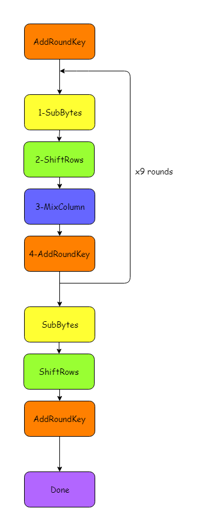
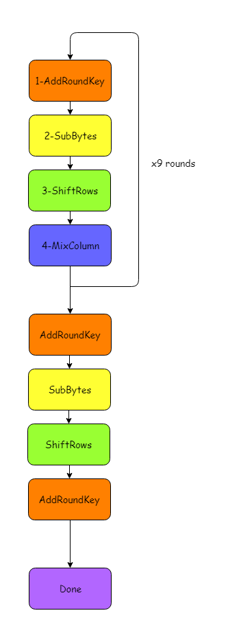
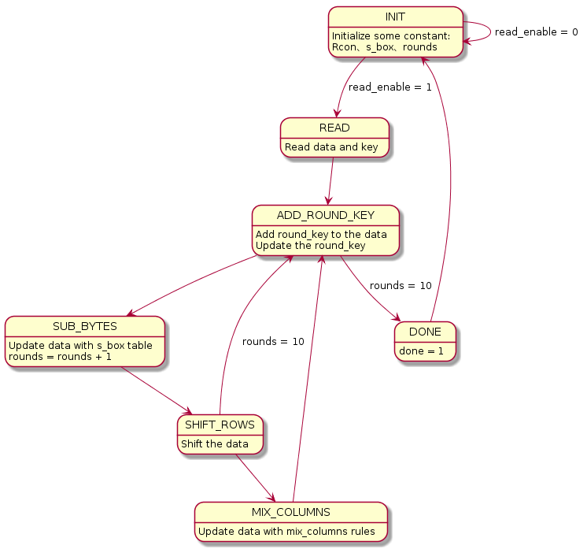
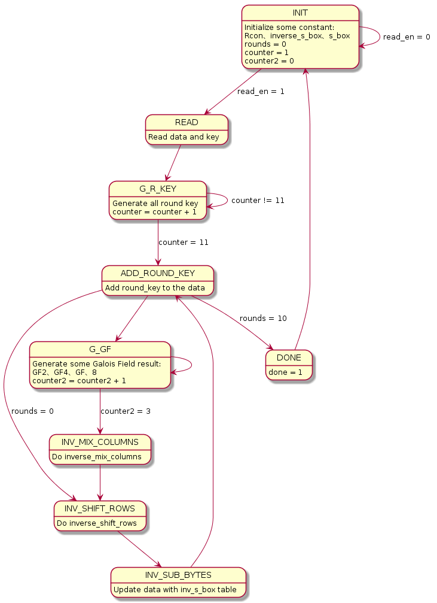
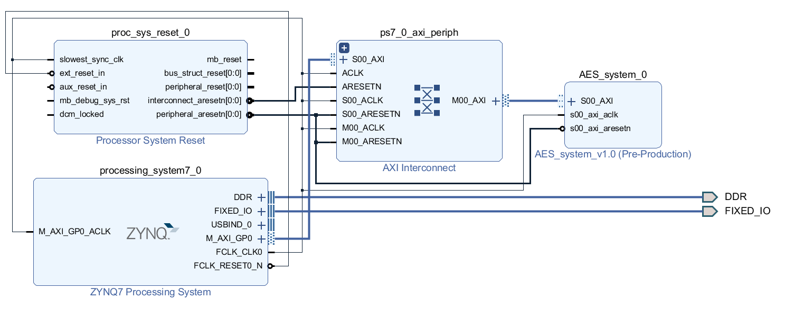
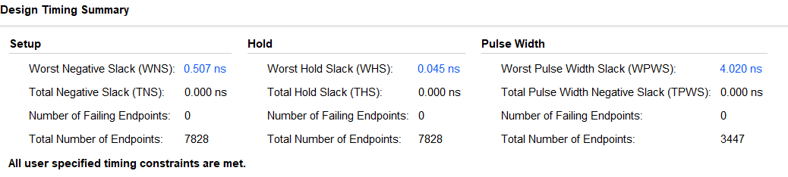
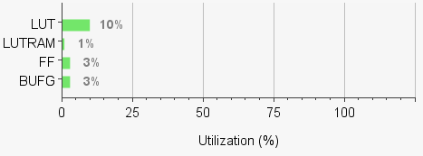
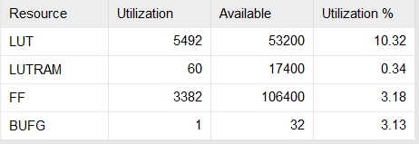
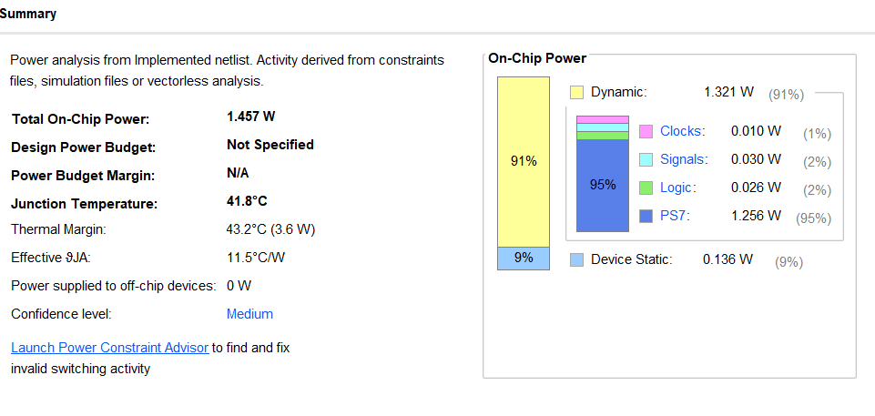
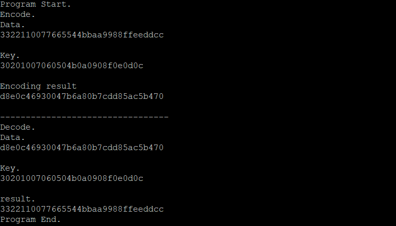

# FPGA-based System Design AES Final Project

## 成員名單
* E24066242劉祐誠
* E24066608紀乃寧
* E24054041林聖堯

## 設計說明

### 控制流程
* AES標準流程 實作流程: 

#### State graph:

FSM of encoding

FSM of decoding

* INIT:初始化資料
* READ:讀取要編碼的input以及金鑰
* ADD_ROUND_KEY:除了對data與round key做XOR 之外，同時生成下一輪的round key
* SUB_BYTES:依據mapping到的s_box值做替換(使用`Rijndael S-box`)　
* SHIFT_ROWS:列位移運算
* MIX_COLUMNS:在GF場做矩陣相乘
* DONE:結束流程

### Block diagram

### Timing report

### Utilization report
 

### Power report

### Result

