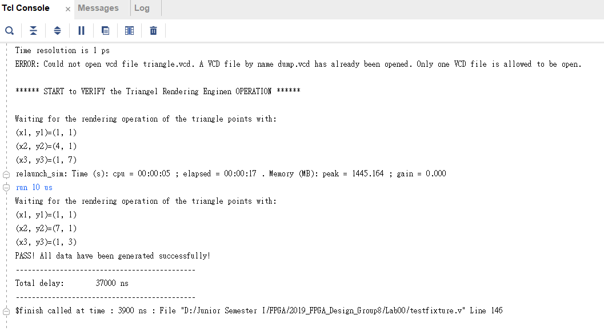
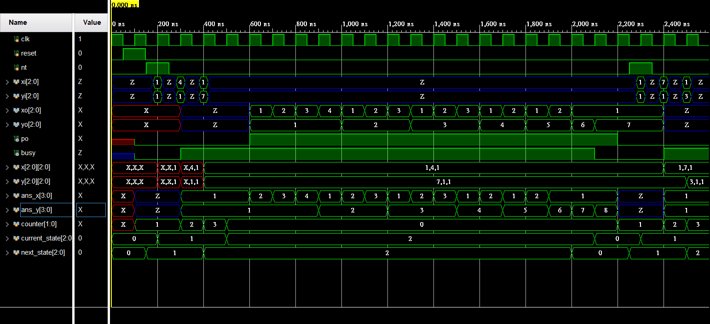
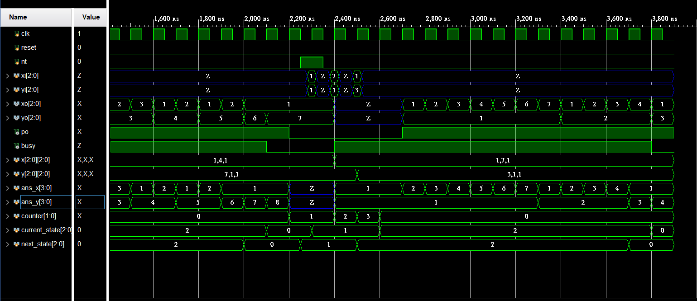

# FPGA-based System Design-Lab00 2019_FPGA_Design_Group8

## 成員名單
組員學號: E24066242、E24066608、E24054041

## 問題描述

此設計之重置(reset)信號為非同步信號,當重置信號釋放(release)後,系統即開始依著時脈信號
的正緣進行同步運作。系統之 nt 信號,當 nt 為高位準時(此時的 busy 信號應為低位準),表示直角
三角形的三個頂點(x1,y1 ) 、(x2,y2)與(x3,y3)座摽,開始依序輸入於系統中。待(x3,y3)頂點座標輸入
前, busy 信號必須由低位準提昇至高位準,以防止下一個(新的)直角三角形的頂點座摽輸入於系統。
待產生輸出結果(xo, yo)的同時,po 信號將由低位準提昇至高位準,以表示系統之輸出為有效之資
料。主辦單位評審將根據參賽者之 po 高位準信號,來判讀設計結果之正確性。此外,所有的測試
輸出結果,將依下列範例之輸出順序(先由左而右,再由下而上),依序進行輸出。
此直角三角形的三個頂點輸入為(x1,y1)、(x2,y2)與(x3,y3),並有下式之關係。隨所給定的三個
頂點值,使直角三角形平面大小有不同之變化。
```
0< x1 = x3<=7
0< y1 = y2 < y3<=7
(x1、x2、x3、y1、y2、y3 均為正整數)
```
亦即此直角三角形的底邊為水平於直角座標的 X 軸

## 設計說明


### FSM State Diagram


<details>
<summary></summary>
/'INIT state's output'/
INIT: po = 0
INIT: busy = 0
INIT: ans_x = 4'bz
INIT: ans_y = 4'bz
INIT: counter = 2'b1

/'INPUT state's output'/
INPUT: po = 0
INPUT: busy = 1
INPUT: xo = 3'bz
INPUT: yo = 3'bz
INPUT: x[counter] = xi
INPUT: y[counter] = yi
INPUT: ans_x = {1'b0, x[0]}
INPUT: ans_y = {1'b0, y[0]}
INPUT: counter = counter + 1

/'OUTPUT state's output'/
OUTPUT --> INIT : ans_y == {1'b0,y[2]}
OUTPUT --> OUTPUT
</details>

### 模擬結果圖


### 模擬波形圖


