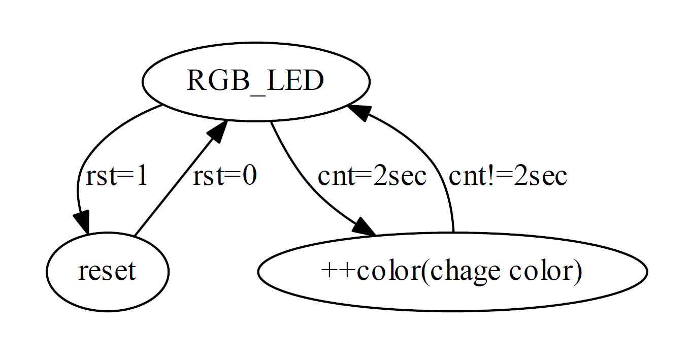
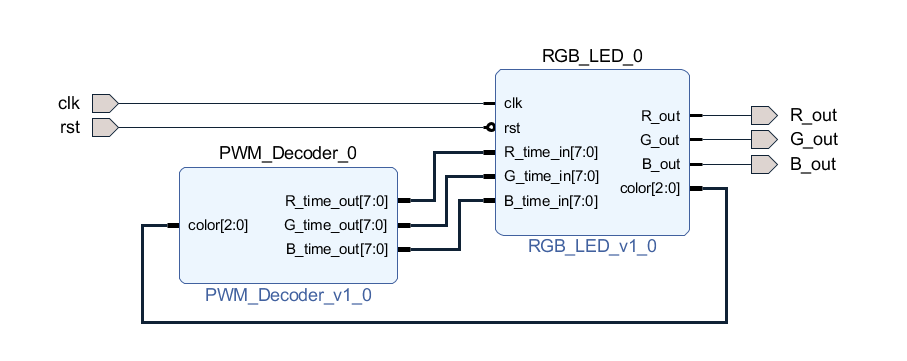
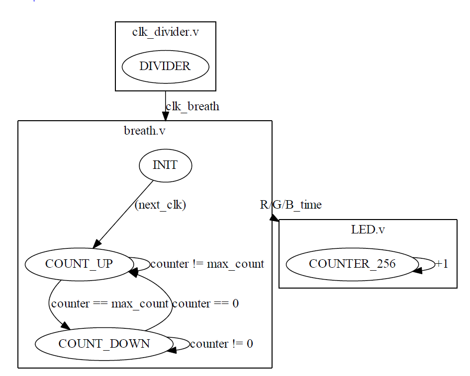
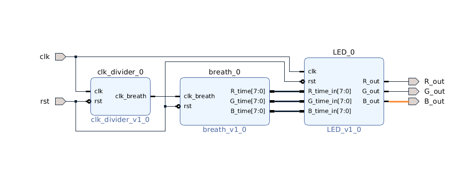
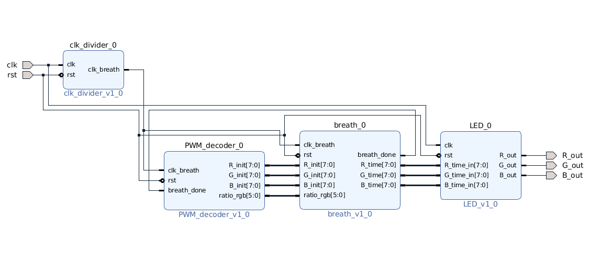

# FPGA-based System Design - Lab02 HW

## 成員名單
* E24066242劉祐誠
* E24066608紀乃寧
* E24054041林聖堯

# Program 1
## 問題描述
透過PWM(pulse width modulation) Decoder的方式，使得 RGB LED有更豐富的色彩變化 ，並透過給予不同的 R、G、B time 來產生彩虹七色。
## 設計說明
## FSM State Diagram


<details>
<summary></summary>

<a href=https://graphviz.readthedocs.io/en/stable/examples.html>tutorial</a><br>
code:<br>

```python
from graphviz import Digraph
g = Digraph('G', filename='fsm.png')
g.node("RGB_LED","RGB_LED")
g.node("reset","reset")
g.node("++color","++color(chage color)")
g.edge("RGB_LED","++color",label="cnt=2sec")
g.edge("++color","RGB_LED",label="cnt!=2sec")
g.edge("RGB_LED","reset",label="rst=1")
g.edge("reset","RGB_LED",label="rst=0")
g.view()
```
</details>

## Block Diagram


在RGB_LED裡，分別有兩個計數器，`counter_256`以及`cnt`。訊號counter_256會重新切割出256個clock period為一新的週期。透過分配RGB三色在週期中的明暗比例，我們就完成了PWM的輸出效果。訊號cnt則是計算秒數，使得電路可以每兩秒變換一次輸出顏色。
* 顏色變換: 紅->橙->黃->綠->藍->靛(偏白)->紫(偏粉紅)
* btn[0]為reset

# Program 2
## 問題描述
同樣透過PWM的方式，製造LED的強弱變化，實作一顆單色呼吸燈

## 設計說明
## FSM State Diagram

<details>
<summary></summary>

code:<br>

```python
from graphviz import Digraph
g = Digraph('G', filename='fsm.png')
g.attr(compound='true')
with g.subgraph(name='cluster_breath') as b:
	b.node("INIT","INIT")
	b.node("COUNT_UP","COUNT_UP")
	b.node("COUNT_DOWN","COUNT_DOWN")
	b.edge("INIT","COUNT_UP",label="(next_clk)")
	b.edge("COUNT_UP","COUNT_DOWN",label="counter == max_count")
	b.edge("COUNT_UP","COUNT_UP",label="counter != max_count")
	b.edge("COUNT_DOWN","COUNT_UP",label="counter == 0")
	b.edge("COUNT_DOWN","COUNT_DOWN",label="counter != 0")
	b.attr(label='breath.v')

with g.subgraph(name='cluster_divider') as d:
	d.node("INIT2","DIVIDER")
	d.attr(label="clk_divider.v")


with g.subgraph(name="cluster_LED") as l:
	l.node("COUNTER","COUNTER_256")
	l.edge("COUNTER","COUNTER",label="+1")
	l.attr(label="LED.v")


g.edge("INIT","COUNTER",ltail="cluster_breath",lhead="cluster_LED",label="R/G/B_time")
g.edge("INIT2","INIT",ltail="cluster_divider",lhead="cluster_breath",label="clk_breath")
g.view()
```
</details>

## Block Diagram


架構與上一題大致相同，只是不須變換顏色，並增加一個breath電路。`breath.v`裡的counter會在`COUNT_UP`state的時候增加；`COUNT_DOWN`state的時候減少。接著讓LED的強弱透過PWM_decoder隨著這個counter變化`R_time = 255 - (3 * counter)`，我們就能得到呼吸燈的效果。


# Bonus-七色呼吸燈
## 設計架構圖


### clk_divider
- 使用 counter 計數，產生 clk_breath 訊號，led 的 PWM 號會依照 clk_breath 訊號的週期而改變

### PWM_decoder
- 七個 state 分別代表 七種顏色
- 若收到 breath module 傳來的 breth_done 訊號，則切換 state 

### breath
- 分為 count_up 及 count_down 兩個 state，前者會使 led 燈的亮度遞減，而後者會使 led 燈亮度遞增

### LED
- 決定 RGB led 燈的輸出頻率，以控制顏色

## Demo


