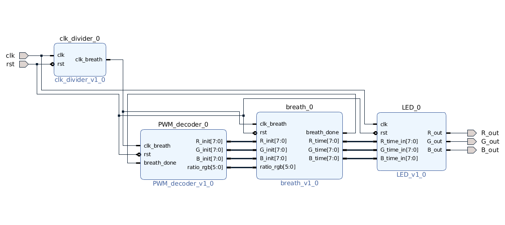

# 七色呼吸燈
## 設計架構圖

### clk_divider
- 使用 counter 計數，產生 clk_breath 訊號，led 的 PWM 號會依照 clk_breath 訊號的週期而改變

### PWM_decoder
- 七個 state 分別代表 七種顏色
- 若收到 breath module 傳來的 breth_done 訊號，則切換 state 

### breath
- 分為 count_up 及 count_down 兩個 state，前者會使 led 燈的亮度遞減，而後者會使 led 燈亮度遞增

### LED
- 決定 RGB led 燈的輸出頻率，以控制顏色

## Demo

