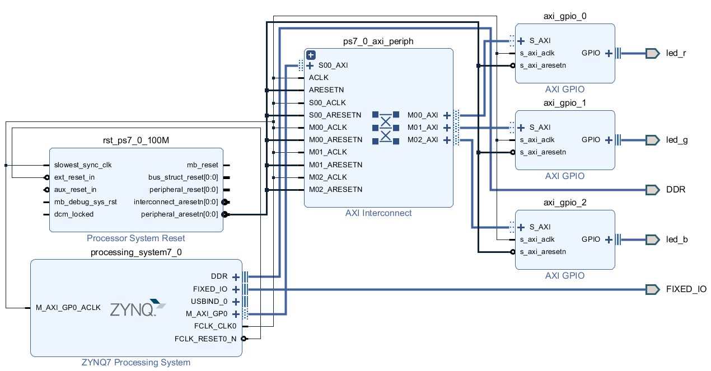
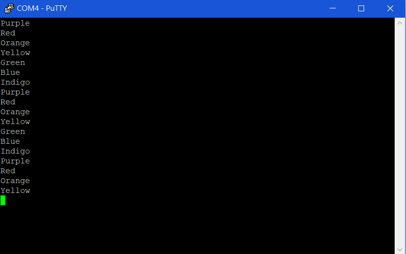
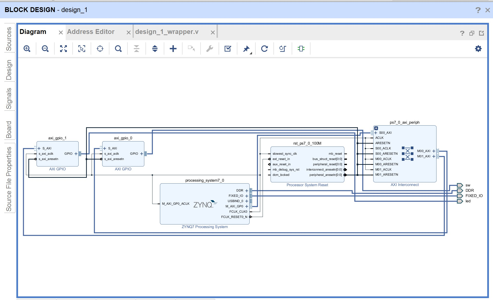
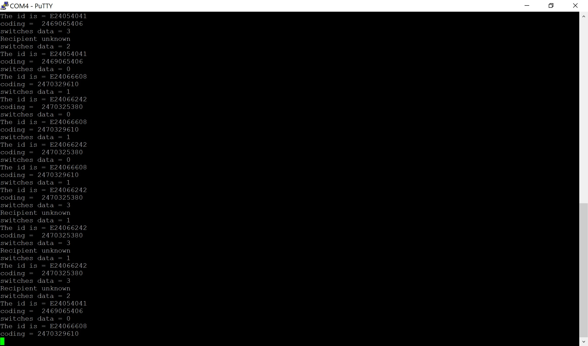
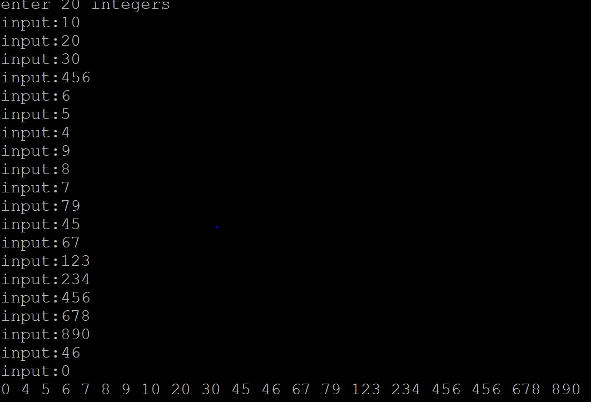

# FPGA-based System Design Lab03_HW

## 成員名單
* E24066242劉祐誠
* E24066608紀乃寧
* E24054041林聖堯

# Question1
### ZYNQ CPU 儲存資料的方式是 little endian
方法:
* [code](https://github.com/BlueBug12/2019_FPGA_Design_Group8/blob/master/Lab03/src/question1.c)
* [執行結果](https://github.com/BlueBug12/2019_FPGA_Design_Group8/blob/master/Lab03/images/question1_output.jpg)

# Problem 1
## 設計說明
使用Lab2 PWM_Decoder的方式，使得RGB LED能有更豐富的色彩變換

* 約每隔兩秒變換一次顏色
* Putty 上會顯示現在的顏色
* 輸出順序: Red->Orange->Yellow->Green->Blue->Indigo->Purple

## Block Diagram

## Output Result (Putty)

# Problem 2
## 設計說明
### 使用djb2
* djb2是一個產生隨機分佈的的雜湊函式
* X = (a * X) + c; // "mod M", M = 2^32 或 2^64
     M常取一個較大的質數，以減少衝突
* 雜湊函式構造簡單，易於實現
* 使用移位和相加的操作，所以計算速度快

## Block Diagram

## Output Result (Putty)

# Problem 3
使用鍵盤輸入 20 個非負整數後，將此數列從小排到大
(bubble sort)

## Output Result (Putty)

