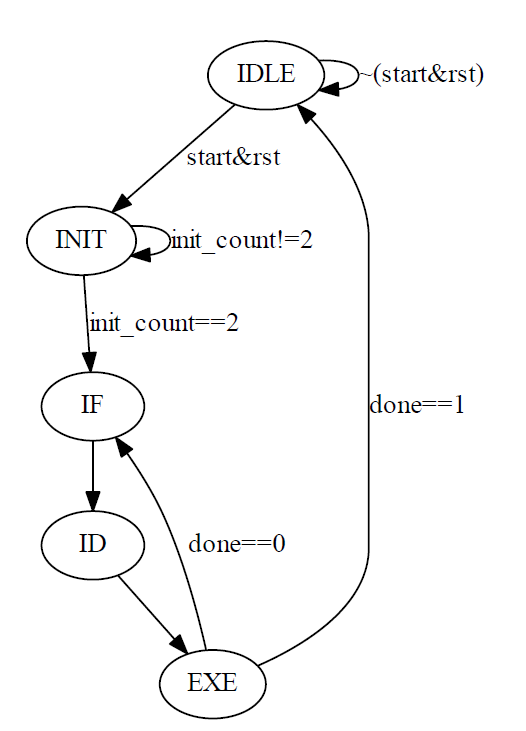

# FPGA-based System Design Lab05_HW

## 成員名單
* E24066242劉祐誠
* E24066608紀乃寧
* E24054041林聖堯

## 設計說明
* mem256X32.v
  * 256個32bits reg的block memory
  * 依據signal `write_enable`決定寫入還是讀取

* mux.v
  * 由signal `ps_or_pl` 決定data由AXI CPU或Processor傳遞

* processor.v
  * 使用sequential circuit
  * 計算2*2的矩陣，且將每個數字訂為4bits，兩個矩陣的運算有8個數字，因此總共需8 * 4=32bits
  * 具有Add、Subtract、Multiply、Transform、Determine五種計算功能
  * 若為`in_data`為instruction，取前面3bits當作OP code，後面8bits為寫入memory的address

  #### state graph:
 
 <details>
 <summary></summary>
 code:<br>
 ```python
 from graphviz import Digraph
  g = Digraph('G', filename='fsm.png')
  g.node("IDLE","IDLE")
  g.node("INIT","INIT")
  g.node("IF","IF")
  g.node("ID","ID")
  g.node("EXE","EXE")
  g.edge("IDLE","INIT",label="start&rst")
  g.edge("IDLE","IDLE",label="~(start&rst)")
  g.edge("INIT","IF",label="init_count==2")
  g.edge("INIT","INIT",label="init_count!=2")
  g.edge("IF","ID",label="")
  g.edge("ID","EXE",label="")
  g.edge("EXE","IDLE",label="done==1")
  g.edge("EXE","IF",label="done==0")
  g.view()
  ```
 </details>

    * IDLE:閒置
    * INIT:讀取`in_data`八個數字的資料(皆存在memory 255 的位置)
    * IF:從memory讀取instruction
    * ID:delay一個cycle，讓EXE能讀到正確指令
    * EXE:依據讀到的op code執行運算
